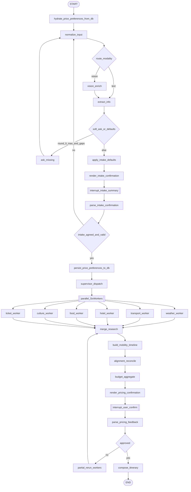

# multi_agent_travel_helper — 设计说明

> 架构与状态机设计见下文。**实现**已落地：`multi_agent_travel_helper_agent.py`、`workers.py`、`pref.db`（SQLite，已加入仓库根 `.gitignore`）、注册名 **`multi-agent-travel-helper`**。**检索拓扑**：`supervisor` → `research_fanout` → **六条边**至各 `worker_*`，再 **fan-in** 至 `mobility_budget`；`research` 使用 **浅合并 reducer**。**定价不通过**时走 `rerun_workers`（`parse_pricing_rerun_targets` + `rerun_selected_workers`），仅重跑相关子块而非六路全量。**对齐**：`mobility_align_and_budget` 按 `trip_start_date`+天数窗口过滤 `hotels`/`food`/`tickets`/`transport` 的 `line_items` 并刷新小计与 `alignment_report`。**结构化**：worker 侧优先解析 Markdown 的 **json 代码围栏**内数组。兼容用 `run_all_workers_parallel` 仍可在单节点内 `gather` 六路。

与 [simple_travel_planner_agent](../simple_travel_planner_agent/simple_travel_planner_agent.py) 隔离实现。

---

## 0. 多模态与结构化分发

- **多模态**：与 `simple_travel_planner` 一致，支持 **纯文、纯图、图+文**；`vision_enrich` 后再 `extract_info`，识别 `destination`、`sites` 等（复用 `MultimodalInputProcessor` 模式）。
- **不再用单一 `interests`**：拆为景点 / 美食 / 分项价格偏好（见 §4.1），便于 **supervisor 向各子智能体结构化分发**（如 Ticket 读 `sites` + `site_price_preference`，Food 读 `food_preference`，Transport 读 `travel_price_preference`）。

---

## 1. 子智能体清单（6 个业务子智能体）

编排节点（不计入下表）：**supervisor**、**merge**、**compose_itinerary**、**budget_aggregate** 等。

| 子智能体 | 职责 | 报价汇总 |
|----------|------|----------|
| **Weather** | 行程日期窗口内天气预报与出行提示 | 否 |
| **Transport** | 机票/火车票：价格、出发/到达时间、始发/终到枢纽 | **是** |
| **Hotel** | 酒店：间夜价、晚数、间数（由人数推导） | **是** |
| **Food** | 饭店名、人均、单餐总价（× 人数），多日多行 | **是** |
| **Culture** | 文化、背景、节庆展览等 | 否 |
| **Ticket** | 景点门票：单人价、景点名、门票小计 | **是** |

---

## 2. 数据接口：飞猪等 vs Tavily

- OTA 开放接口首版 **不依赖**；默认 **Transport / Hotel / Food / Ticket** 各用 **Tavily（或统一 web search）** + 结构化抽取。
- 产出须含 `sources` 与 **免责声明**；价格为 **估算**。

---

## 3. 四类计价与旅行总预算规则

### 3.0 总预算语义

- **`budget`**：用户声明的 **整次旅行总预算**（四类可计价之和的参照）；分项档次由 `travel_price_preference` / `site_price_preference` / `hotel_price_preference` 引导。
- **`budget_vs_user`**：`under_budget`；**`within_tolerance`**（超支 ≤10%）；**`over_cap`**（>10%）；**`unspecified`**（未声明预算则不做 10% 硬比）。
- **低于预算**：**不得** 人为抬高报价或换更贵方案以凑满预算。

### 3.1–3.4 各 worker

- **Transport**：班次/航班、`line_items`、per_person / per_order 语义明确。
- **Hotel**：归一为每间每晚；`rooms_needed = ceil(party_size / occupancy_per_room)`；晚数口径产品内二选一写死。
- **Food**：人均 × `party_size`；每日餐数假设写入 `assumptions`。
- **Ticket**：与 `sites`（及 culture 建议）对齐；`culture` 与 `ticket` 仅经 **state** 协作。

---

## 4. 状态机字段

### 4.1 Intake：**仅 B 类策略**（无单独 A 类分档）

**约定**：**不再**维护「A 类必填无默认 / B 类可默认」两档。**所有 intake 字段**统一采用：

1. **有限轮次（如 1～2）** 的 **`ask_missing`**：一次列出当前仍缺的项（软提示，非无限追问到死）。
2. **`apply_intake_defaults`**：对仍空字段 **幂等** 写入 **配置的默认值**；无安全默认的字段（如 `destination`、`origin_city`）可保持 **`null`**，记入 `intake_defaults_applied` 或 `intake_gaps`，在摘要中 **高亮「待补充」**。
3. **`render_intake_confirmation`** → **`interrupt`** → **`parse_intake_confirmation`**：用户确认或修改；**仅当关键槽位满足产品规则（如 `destination`、`origin_city`、`trip_start_date` 非空等）且用户同意** 时置 `intake_confirmed=True`。否则回到 `normalize_input` → `extract_info`，不启动子智能体。

**结构化槽位**

| 槽位 | 含义 | 典型消费者 |
|------|------|------------|
| `sites` | 景点/地标列表 | Ticket、Culture、Hotel、部分 Food |
| `food_preference` | 美食偏好 | Food |
| `travel_price_preference` | 交通价位/舒适度取向 | Transport |
| `site_price_preference` | 门票价位取向 | Ticket |
| `hotel_price_preference` | 酒店档次取向 | Hotel |

**B 类默认值表示例**（实现常量可配）

| 字段 | 默认示例 |
|------|----------|
| `trip_duration_days` | 如 `5` |
| `budget` / `budget_amount` | 未提供 → `budget_mode=unspecified` |
| `party_size` | 如 `2` |
| `food_preference` | 空或「无特殊」 |
| 三项 `*_price_preference` | 中性文案，或来自 **SQLite 偏好库**（§4.2） |
| `occupancy_per_room` | `2` |
| `meals_per_day` | `2`（午+晚） |
| `transport_mode_hint` | 可与 `travel_price_preference` 合并 |

**可选（C）**：`hotel_preferences`、`dietary_restrictions` 等，摘要说「未填写」即可。

### 4.2 价格偏好存储：轻量 SQLite（`pref.db`）

因用户量大，**不再使用按用户拆分的 Markdown 文件**；改为 **单文件 SQLite**，与全局 Postgres/Qdrant **对话摘要** 仍 **解耦**（仅存本智能体三项价格偏好，体量最小）。

- **库文件路径**：`src/agents/multi_agent_travel_helper/pref.db`（相对仓库根；实现时用包内绝对路径解析）。
- **引擎**：SQLite；**暂不考虑** 将该路径 **挂载为 Docker volume**（首版按本地/容器内文件落盘即可，部署时再评估迁移与备份）。
- **主键**：`user_id`（`TEXT` 或项目统一类型），**唯一**，一行一用户，支持对该用户的偏好 **增 / 删 / 改 / 查**。
- **建议表结构**（实现时可微调列名）：
  - `user_id` PRIMARY KEY
  - `travel_price_preference`、`site_price_preference`、`hotel_price_preference`（`TEXT`，可空）
  - `updated_at`（`INTEGER` Unix 或 ISO 字符串，便于排查）
- **`hydrate_price_preferences_from_db`**（原「从 MD  hydrate」）：`START` 后尽早执行；按 `RunnableConfig` 中的 **user_id** 查询，若存在则预填 state 中三项价格偏好。
- **优先级**：**用户本轮明确输入** > **SQLite 中该 user 记录** > **代码默认**。
- **`render_intake_confirmation`**：单独一节展示三项偏好及来源（`用户本轮` / `历史记录` / `系统默认`）。
- **`persist_price_preferences_to_db`**：`intake_confirmed` 后、**`supervisor` 前**，将当前定稿的三项偏好 **UPSERT** 写入 `pref.db`；失败只打日志、**不阻塞** supervisor。
- **可选**：若需与旧设计一致做「自然语言归一」，可在 UPSERT 前增加 **轻量 LLM** 将用户原话压缩为偏好短文本再入库；非必须。
- **仓库卫生**：`pref.db` 含用户数据，**建议加入 `.gitignore`**，避免误提交。

### 4.3 采集流程（与图一致）

1. `extract_info`（多模态先 `vision_enrich`）。
2. 若 **`intake_collect_round` < 上限** 且仍存在 **待采集项** → `ask_missing` → `normalize_input`；否则进入步骤 3。
3. `apply_intake_defaults`。
4. `render_intake_confirmation` → `interrupt` → `parse_intake_confirmation`。
5. 不同意 → `normalize_input` → `extract_info`（用户修改优先于库中记录）；同意 → `persist_price_preferences_to_db` → `supervisor_dispatch`。
6. `intake_confirm_round` 上限防死循环。

### 4.4 状态字段摘记

- `intake_defaults_applied`、`intake_confirmed`、`intake_summary_md`、`intake_confirm_round`、`intake_collect_round`
- `research.*`（六键 + 四类结构化 `line_items`，含 `date`/`city`/单价/数量/行小计/`evidence_summary`/`source_url`）
- `budget_breakdown`、`budget_vs_user`、`mobility_timeline`、`alignment_report`、报价 HITL 相关字段

### 4.5 全行程预算汇总层

- `budget_aggregate` 产出 `budget_breakdown` 与 `budget_vs_user`（含 10% 规则）。

---

## 5. 报价人机协同（第二道门）

- 四类 **MD 表**（概述、单价、数量、行小计、来源）+ 合计 + 对齐摘要。
- `interrupt` → `parse_pricing_feedback` → 通过则 `compose`；否则 **局部重跑** worker → merge → mobility/align → 预算 → 再确认。
- `pricing_confirm_round` 上限。

---

## 6. 时空对齐（并发之后）

- `trip_start_date` + `trip_duration_days` → `trip_end_date` / `trip_window`。
- `build_mobility_timeline`（由交通 + intake，MVP 单枢纽）→ `alignment_reconcile` 校验 hotel/food/ticket 的 `date`/`city`。
- 冲突：规则修复或带约束重跑 food 等；脚注告知用户。

---

## 7. 图结构（Mermaid）

---

## 8. 待产品拍板

- **`destination` / `origin_city` / `trip_start_date` / `sites`**：无代码默认时，**确认环**通过条件（必填非空列表）。
- **`pref.db` 表字段细化**与 **`user_id` 在 `RunnableConfig` 中的字段名**。
- **酒店晚数**、**每日餐数**假设。
- **intake / 报价** 确认各自轮次上限。
- **Mobility MVP** 是否固定单枢纽 `destination`。
